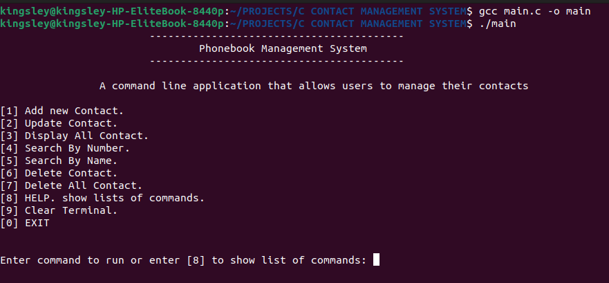
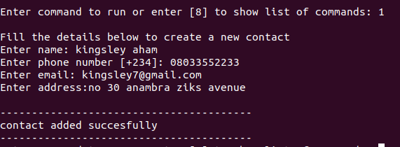
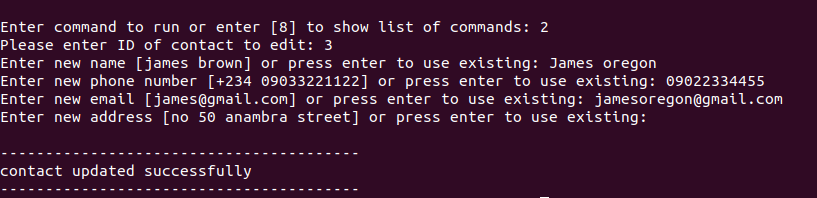
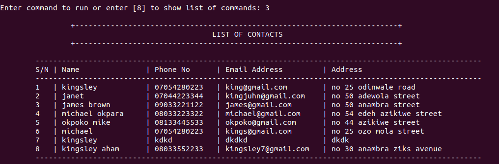
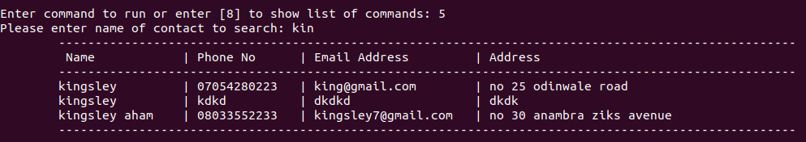
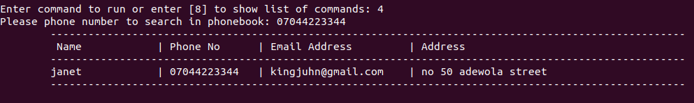
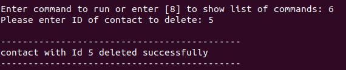
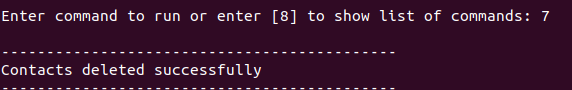

# Phonebook Management System

Phonebook Management System is a command line application allows users to store, organize and manage their contact records efficiently. The system is designed to have functions such as adding, updating, viewing, searching and deleting of contacts.

## Features

We have used many functions in this project. These functions are very easy to understand as their name itself signifies their respective operations.

- Add New Contact
- Update Contact
- Display All Contact
- Search By Name
- Search By Number
- Delete Contact
- Delete All Contact
- Clear Terminal

## Requirements for using it

- A software (IDE) for reviewing the code
- C/C++ compiler (Recommended: GCC Compiler)
- Any Command Line tool

**Note:** This program was only testing in linux environment.Incase you encounter any issue running it on windows. kindly reach out to me.

## Contributing

- If you wish to contribute a new function or want to improve the code quality, you are welcome for your contributions.

- Fork the repository & make changes, after completion open pull request.

## Screenshots 🖼️

### 01. Introduction Screen



### 02. Add New Contact



### 03. Update Contact



### 04. Display All Contact



### 05. Search By Name



### 06. Search By Number



### 07. Delete Contact



### 08. Delete All Contact



## MIT LICENSE 📔

```LICENSE
Copyright (c) 2024 Kingsley

Permission is hereby granted, free of charge, to any person obtaining a copy
of this software and associated documentation files (the "Software"), to deal
in the Software without restriction, including without limitation the rights
to use, copy, modify, merge, publish, distribute, sublicense, and/or sell
copies of the Software, and to permit persons to whom the Software is
furnished to do so, subject to the following conditions:

The above copyright notice and this permission notice shall be included in all
copies or substantial portions of the Software.

THE SOFTWARE IS PROVIDED "AS IS", WITHOUT WARRANTY OF ANY KIND, EXPRESS OR
IMPLIED, INCLUDING BUT NOT LIMITED TO THE WARRANTIES OF MERCHANTABILITY,
FITNESS FOR A PARTICULAR PURPOSE AND NONINFRINGEMENT. IN NO EVENT SHALL THE
AUTHORS OR COPYRIGHT HOLDERS BE LIABLE FOR ANY CLAIM, DAMAGES OR OTHER
LIABILITY, WHETHER IN AN ACTION OF CONTRACT, TORT OR OTHERWISE, ARISING FROM,
OUT OF OR IN CONNECTION WITH THE SOFTWARE OR THE USE OR OTHER DEALINGS IN THE
SOFTWARE.
```
